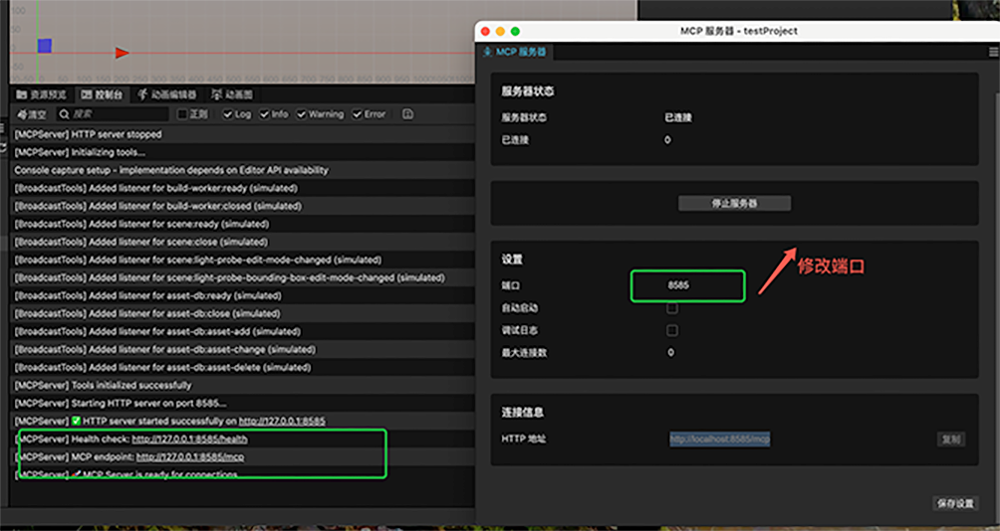
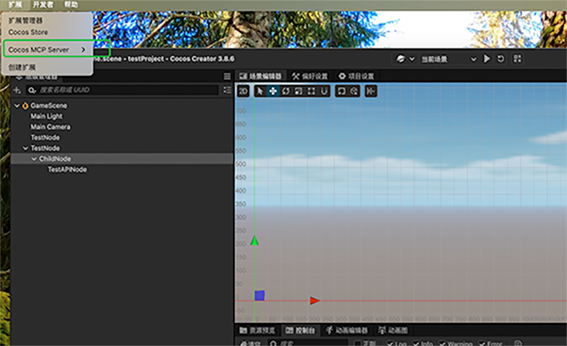

# Cocos MCP Server（CreatorFramework Fork）

**[📖 English](README.EN.md)**  **[📖 中文](README.md)**

这是基于上游 `DaxianLee/cocos-mcp-server` 的维护分支。本文档聚焦本仓库的实际改动，不再重复上游的大篇幅通用说明。

## 界面预览

### 主控制台（服务控制 / 工具管理）



### 扩展菜单与服务面板示例



## 我们的核心变更

- 面板前端重构：从旧模板改为 `Vite + Vue 3 + Tailwind CSS + Element Plus`。
- 单面板整合：移除独立 `tool-manager` 面板，将工具管理并入主控制台标签页。
- 服务器控制增强：新增 `restart-server-from-dist` 热重启能力，完善设置更新后的服务重建流程。
- MCP 兼容性增强：补充会话 ID 管理、notification 请求处理、JSON 容错解析。
- 工具能力补强：新增/完善 `set_component_properties` 等批量组件属性操作。
- UI/交互优化：分类工具开关、启用统计、保存态反馈、状态轮询与提示消息。

## 快速开始

```bash
cd extensions/cocos-mcp-server
npm install
npm run build
```

仅构建面板前端：

```bash
npm run build:panel
```

开发模式：

```bash
npm run watch
```

## MCP 连接地址

服务启动后默认地址：`http://127.0.0.1:3000/mcp`

Claude CLI 示例：

```bash
claude mcp add --transport http cocos-creator http://127.0.0.1:3000/mcp
```

## 仓库结构（当前重点）

```text
cocos-mcp-server/
├── source/                    # 插件主逻辑与 MCP 服务
├── panel-ui/                  # 新面板前端工程（Vue + Vite）
├── dist/                      # 构建产物（含 dist/panel-ui）
├── vite.panel.config.ts       # 面板构建配置
├── tailwind.config.ts         # Tailwind 配置
└── package.json               # 脚本与扩展声明
```

## 与上游关系

- 上游仓库：`https://github.com/DaxianLee/cocos-mcp-server`
- 本仓库定位：用于 CreatorFramework 团队的功能迭代与稳定性维护。
- 若与上游文档描述不一致，以本仓库代码和本 README 为准。

## 许可证

沿用上游仓库许可证与使用约束。
